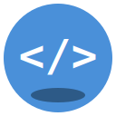

# 🏝️ CodeIsland - 代码岛传奇

<div align="center">



**一个面向成人初学者的Python编程学习RPG游戏**

[](https://godotengine.org/)
[](LICENSE)
[](https://www.python.org/)

</div>

---

## 📖 简介

CodeIsland 是一款通过RPG游戏形式教授Python编程的教育游戏。玩家将在神秘的"代码岛"上冒险，通过编写真实的Python代码来解决谜题、完成任务，最终掌握从入门到实战的完整Python知识体系。

## 🎮 游戏特色

- **🎮 RPG冒险**：探索代码岛，与NPC互动，完成任务
- **💻 真实编程**：编写真正的Python代码，非伪代码
- **📈 完整体系**：从变量到面向对象，8章完整课程
- **🏆 成就系统**：解锁成就，获得奖励
- **💾 存档系统**：随时保存学习进度

## 🗺️ 游戏章节

| 章节 | 名称 | 知识点 | 场景 |
|-----|------|-------|------|
| 第1章 | 初入代码岛 | 变量、数据类型 | 新手村 |
| 第2章 | 商人的请求 | 运算符、字符串 | 商业区 |
| 第3章 | 森林迷宫 | 条件判断 | 迷雾森林 |
| 第4章 | 矿工的秘密 | 循环、列表 | 水晶矿洞 |
| 第5章 | 魔法学院 | 函数、递归 | 魔法塔 |
| 第6章 | 宠物驯养师 | 类与对象 | 牧场 |
| 第7章 | 图书管理员 | 文件、异常、模块 | 古老图书馆 |
| 第8章 | 岛屿守护者 | 项目实战 | 全岛 |

## 🚀 快速开始

### 系统要求

- Windows 10/11
- [Godot 4.3](https://godotengine.org/download) 或更高版本
- Python 3.11+ (用于代码执行器)

### 运行方式

1. 克隆仓库
```bash
git clone https://github.com/YOUR_USERNAME/CodeIsland.git
cd CodeIsland
```

2. 用Godot打开项目
```bash
# 打开Godot编辑器，选择"导入"，选择 project.godot 文件
```

3. 运行游戏
- 在Godot编辑器中按 `F5` 或点击运行按钮

## 🛠️ 技术栈

- **游戏引擎**: Godot 4.3
- **脚本语言**: GDScript
- **Python集成**: Python.NET
- **版本控制**: Git

## 📁 项目结构

```
CodeIsland/
├── assets/          # 游戏资源 (精灵、音频、字体等)
├── scenes/          # Godot场景文件
├── scripts/         # GDScript脚本
│   ├── autoload/    # 自动加载(单例)
│   ├── core/        # 核心系统
│   ├── entities/    # 实体脚本
│   └── ui/          # UI脚本
├── data/            # 游戏数据 (JSON)
├── resources/       # Godot资源
└── addons/          # 插件
```

## 🤝 参与贡献

欢迎参与开发！请查看 [贡献指南](CONTRIBUTING.md) 了解详情。

### 开发环境设置

1. Fork 本仓库
2. 创建功能分支: `git checkout -b feature/amazing-feature`
3. 提交更改: `git commit -m 'feat: 添加某某功能'`
4. 推送分支: `git push origin feature/amazing-feature`
5. 创建 Pull Request

## 📝 版本历史

查看 [CHANGELOG.md](CHANGELOG.md) 了解版本更新历史。

## 📄 许可证

本项目基于 [MIT License](LICENSE) 开源。

## 🙏 致谢

- [Godot Engine](https://godotengine.org/) - 开源游戏引擎
- [Python](https://www.python.org/) - 编程语言
- 所有贡献者

---

<div align="center">

**[⬆ 回到顶部](#️-codeisland---代码岛传奇)**

</div>
